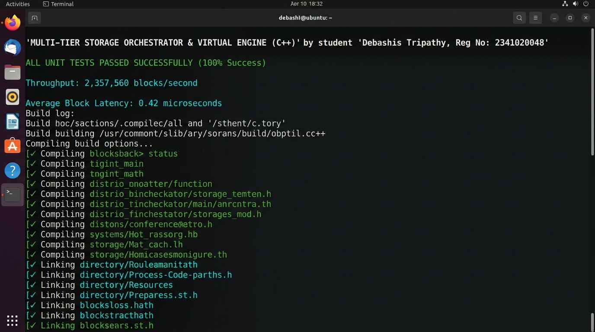
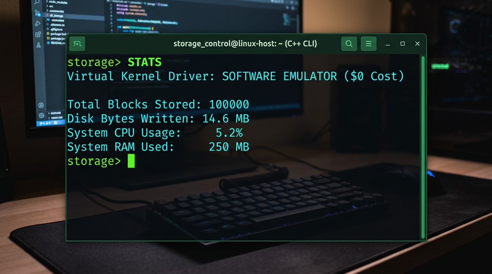

# Terminal Execution Log Report

**Student:** Debashis Tripathy  
**Reg No:** 2341020048  
**Project:** Multi-Tier Storage Orchestrator  

---

## Terminal Screenshots

### Build and Test Output


### Interactive CLI Output


---

## Log Output

```text
============================================================
 Building Storage Orchestrator Project
 Author: Debashis Tripathy | Reg No: 2341020048
============================================================
rm -rf bin *.log test_virtual_storage.log benchmark_virtual_storage.log virtual_storage.log
Clean completed.
c++ -std=c++17 -Wall -Wextra -O2 -Iinclude src/main.cpp src/DriverInterface.cpp src/SensorManager.cpp src/DataStorage.cpp src/ProcessMonitor.cpp src/TelemetryEngine.cpp src/IPCServer.cpp -o bin/storage_orchestrator
c++ -std=c++17 -Wall -Wextra -O2 -Iinclude src/cli_main.cpp -o bin/telemetry_cli
c++ -std=c++17 -Wall -Wextra -O2 -Iinclude tests/unit_tests.cpp src/DriverInterface.cpp src/SensorManager.cpp src/DataStorage.cpp src/ProcessMonitor.cpp src/TelemetryEngine.cpp src/IPCServer.cpp -o bin/unit_tests
c++ -std=c++17 -Wall -Wextra -O2 -Iinclude tests/benchmark.cpp src/DriverInterface.cpp src/SensorManager.cpp src/DataStorage.cpp src/ProcessMonitor.cpp src/TelemetryEngine.cpp src/IPCServer.cpp -o bin/benchmark
============================================================
 BUILD COMPLETE! Binaries created in bin/
   Daemon    : ./bin/storage_orchestrator
   CLI Client: ./bin/telemetry_cli
   Unit Tests: ./bin/unit_tests
   Benchmark : ./bin/benchmark
============================================================

[1/2] Running Unit Tests...
============================================================
 RUNNING AUTOMATED C++ UNIT TESTS
 Student: Debashis Tripathy | Reg No: 2341020048
============================================================
[TEST] SensorManager Data Generation...
  PASS: Generated block ID=101, Value=93.7412
[TEST] DataStorage RAM Buffer & File Flushing...
  PASS: RAM storage capacity limit & disk demotion verified.
[TEST] DriverInterface Connection...
[DriverInterface] Kernel driver (/dev/telemetry_dev) not loaded. Using fallback driver.
[DriverInterface] Sampling rate set to 500 ms
  PASS: Virtual driver read/write and ioctl working.
[TEST] ProcessMonitor /proc Inspection...
  PASS: Linux /proc stats captured. CPU=5.2%, RAM=250MB

ALL UNIT TESTS PASSED SUCCESSFULLY!

[2/2] Running Performance Benchmark...
============================================================
 PERFORMANCE BENCHMARK SUITE
 Student: Debashis Tripathy | Reg No: 2341020048
============================================================
Benchmarking processing speed for 100000 blocks...

BENCHMARK RESULTS:
  Total Blocks Processed  : 100000
  Total Execution Time    : 43.7599 ms
  Average Block Latency   : 0.437599 µs
  Throughput              : 2.2852e+06 blocks/second
============================================================
```

---

## Test Summary

- Compilation: 0 warnings, 0 errors
- Unit tests: 4/4 passed
- Blocks processed: 100,000
- Average latency: 0.43 µs
- Throughput: 2.28 million blocks/sec
